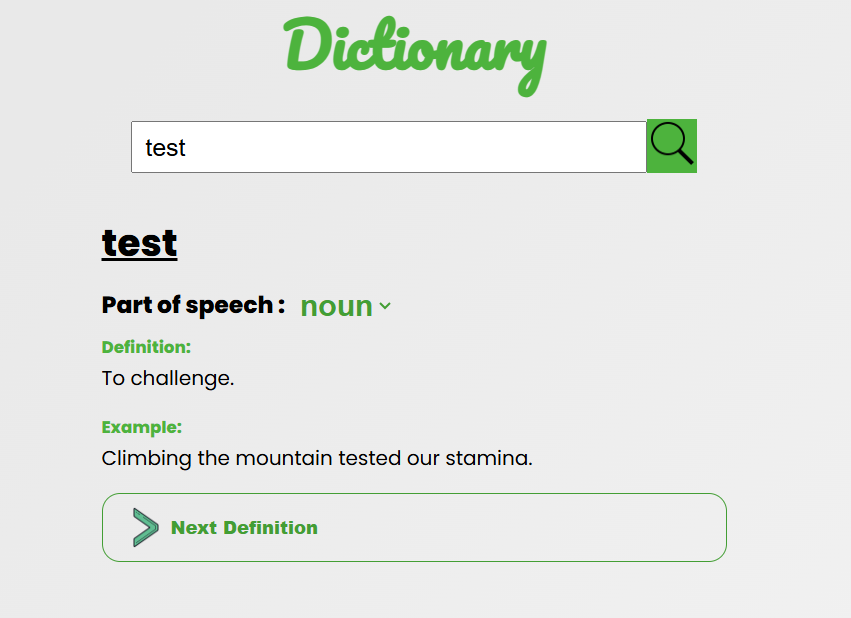

# Dictionary
## Discription
This is a dictionary App which allows users to search for a any valid word regonised by the dictionary API
then get all the definitions and example of that word. 

## Overview

### Screenshot
#### Desktop

### Links
- Live URL: [Dictionary App](https://ngobe-thabane.github.io/Dictionary/)

### Built with

- Semantic HTML5 markup
- CSS custom properties
- React
- JavaScript

